# Early intermittent hyperlipidaemia alters tissue macrophages to boost atherosclerosis
Minoru Takaoka1, Xiaohui Zhao1\*, Hwee Ying Lim2,3\*, Costan G. Magnussen4,5,6\*,Owen Ang2,3,
Nadine Suffee7, Patricia R. Schrank8, Wei Siong ONG2,3, Dimitrios Tsiantoulas1,9, Felix
Sommer10, Sarajo K. Mohanta11, James Harrison1, Yaxing Meng6, Ludivine Laurans7,
Feitong Wu6, Yuning Lu1, Leanne Masters1, Stephen A Newland1, Laura Denti12,
Mingyang Hong11, Mouna Chajadine7, Markus Juonala13,14, Juhani S.
Koskinen4,5,14,15, Mika Kähönen16,17,18, Tsuneyasu Kaisho19, Andreas J.R.
Habenicht11, Alain Tedgui7, Hafid Ait-Oufella7, Tian X Zhao1, Meritxell Nus1,
Christiana Ruhrberg12, Soraya Taleb7, Jesse W. Williams8, Olli T. Raitakari4,5,20\*,
Véronique Angeli2,3\*, Ziad Mallat1,7
Journal xxx,    

1 Department of Medicine, Cardiovascular Division, University of Cambridge, Heart and Lung Research Institute, CB2 0BB, Cambridge, UK,  
2 Immunology Translational Research Programme, Yong Loo Lin School of Medicine, Dept. of Department of Microbiology and Immunology, National University of Singapore, Singapore.  
3 Immunology Programme, Life Sciences Institute, National University of Singapore, Singapore. 
4 Research Centre of Applied and Preventive Cardiovascular Medicine; University of Turku, Turku, Finland. 
5 Centre for Population Health Research, University of Turku and Turku University Hospital, Turku, Finland. 
6 Baker Heart and Diabetes Institute, Melbourne, Victoria, Australia. 
7 Université de Paris, Institut National de la Santé et de la Recherche Médicale, U970, PARCC, Paris, France. 
8 Department of Integrative Biology & Physiology, Center for Immunology, University of Minnesota, Minneapolis, USA. 
9 Department of Laboratory Medicine, Medical University of Vienna, Vienna, Austria 
10 Institute of Clinical Molecular Biology, University of Kiel and University Hospital Schleswig Holstein (UKSH), Germany 
11 Institute for Cardiovascular Prevention, Ludwig-Maximilians-33 Universität München(LMU), Munich, Germany. 
12 Institute of Ophthalmology, University College London, UK. 
13 Department of Medicine, University of Turku, Turku, Finland. 
14 Division of Medicine, Turku University Hospital, Turku, Finland. 
15 Department of Medicine, Satakunta Central Hospital, Pori, Finland. 
16 Department of Clinical Physiology, University of Tampere, Tampere, Finland. 
17 Faculty of Medicine and Health Technology, University of Tampere, Tampere,Finland. 
18 Finnish Cardiovascular Research Center Tampere, University of Tampere, Tampere, Finland. 
19 Department of Immunology, Institute of Advanced Medicine, Wakayama Medical University, Japan. 
20 Department of Clinical Physiology and Nuclear Medicine, Turku University Hospital, Turku, Finland. 

\* Contributed equally  
**Corresponding authors:** Ziad Mallat (zm255@medschl.cam.ac.uk) 

Code Release for this github: 

## Abstract
Hyperlipidaemia is a major risk factor of atherosclerotic cardiovascular disease (ASCVD). Risk of incident cardiovascular events depends on cumulative lifetime exposure to low-density lipoprotein cholesterol (LDL-C) and, independently, on the time course of exposure to LDL-C, with early exposure being associated with a higher risk. Furthermore, LDL-C fluctuations are strongly associated with ASCVD outcomes. However, the precise mechanisms behind this increased ASCVD risk are not understood. Here, we make the unexpected observation that early intermittent feeding of mice with a high-cholesterol Western-type diet (WD) substantially accelerates atherosclerosis compared with late continuous exposure to WD, despite similar cumulative circulating LDL-C levels. We find that early intermittent hyperlipidaemia alters the number and homeostatic phenotype of resident-like arterial macrophages. Macrophage genes with altered expression are enriched for genes linked to human ASCVD in genome-wide association studies. We show that LYVE1+ resident macrophages are atheroprotective and identify new biological pathways, related to actin filament organisation, whose alteration in arterial macrophages accelerates atherosclerosis. Finally, using the Young Finns Study we show that exposure to cholesterol in childhood is significantly associated with the incidence and size of carotid atherosclerotic plaques in mid-adulthood. In summary, our results identify early intermittent exposure to cholesterol as a strong determinant of accelerated atherosclerosis, highlighting the importance of optimal control of hyperlipidaemia early in life, and providing insight into the underlying biological mechanisms. This knowledge will be essential to designing effective therapeutic strategies to combat atherosclerotic cardiovascular disease.

## Data Availability

* RNASeq data for cWD and iWD: EMBL-EBI ArrayExpress  
  **E-MTAB-12759**(https://www.ebi.ac.uk/biostudies/arrayexpress/studies/E-MTAB-12759)  
Illumina HiSeq 4000 platform, single-end reads (SE50), 2 Runs

* RNASeq data for cWD Nrp1 KO: EMBL-EBI ArrayExpress  
  **E-MTAB-12761**(https://www.ebi.ac.uk/biostudies/arrayexpress/studies/E-MTAB-12761) 
Illumina NovaSeq6000 platform, paired-end reads (PE50)

* single Cell RNASeq data: public data, please check the Supplementary Tables
(**Supplementary Table S23**, Mouse; **Supplementary Table S26** Human).

* Processed Data/Tables are given
Supplementary Tables [[XLSX](Figures_Tables/Supplementary_Tables-Takaoka_etal-Nature_2023-03-04115-R2-Zhao.xlsx)]

## RNASeq Analysis  

### Step 1: Sample Information  
  1.1) **R script:**  SampleSheet_Generating-01.R [[R](Scripts/RNA_Seq/SampleSheet_Generating-01.R)]  
  1.2) **Output:** sample Tables with all available information

      * Macrophage:  
        a) First Batch: Macrophage_FirstBatch_nextflow_SampleTable.csv[[CSV](Data/Macrophage_FirstBatch_SampleTable.csv)]  
        b) Second Batch: Macrophage_SecondBatch_nextflow_SampleTable.csv[[CSV](Data/Macrophage_SecondBatch_SampleTable.csv)]  
      * Nrp1: Nrp1-nextflow_SampleTable.csv[[CSV](Data/Nrp1_SampleTable_cWD.csv)]  

### Step 2: QC and Alignment pipeline

                       (nextflow version 21.05.0, nf-core/rnaseq version 3.2)

2.1) Input spreadsheet  

  * Macrophage_FirstBatch_Nextflow_SampleTable.csv[[CSV](Data/Macrophage_FirstBatch_Nextflow_SampleTable.csv)]  

  * Macrophage_SecondBatch_Nextflow_SampleTable.csv[[CSV](Data/Macrophage_SecondBatch_Nextflow_SampleTable.csv)]  

  * Nrp1_Nextflow_SampleTable.csv[[CSV](Data/Nrp1_Nextflow_SampleTable_cWD.csv)]  

2.2) Bash script: Macrophage_Nrp1_Nextflow_Run-02.sh [[bash](Scripts/RNA_Seq/Macrophage_Nrp1_Nextflow_Run-02.sh)]  

2.3) Alignment summary:  

  * Macrophage: **Supplementary Table S21a**  

  * Nrp1 KO vs WT cWD: **Supplementary Table S21b**  

2.4) Software and versions in Nextflow pipeline:   **Supplementary Table S22**

### Step 3: RNASeq Analysis (R v4.2.1)

Analysis R scripts are given as below:

 * Macrophage_DESeq_GO_Analysis-03.R[[R](Scripts/RNA_Seq/Macrophage_DESeq_GO_Analysis-03.R)]  

 * Nrp1_KOvsWT_cWD_DESeq_GO_Analysis-04.R[[R](Scripts/RNA_Seq/Nrp1_KOvsWT_cWD_DESeq_GO_Analysis-04.R)]  

#### Step 3.1: Differential Analysis

* significant cut-off threshold is (*padj < 0.05 & abs(log2FoldChange) >= 1*);

* DESeq2 analysis for iWD vs cWD (merge two batches, significant DEGs
  **Supplementary Table S1** and **Fig2b**)

* DESeq2 analysis (Nrp1 KO vs WT for cWD, significant DEGs
  (*padj < 0.05 & abs(log2FoldChange) >= 0.6*), **Supplementary Table S12**)

#### Step 3.2: Gene Ontology Analysis

* Input data are the significant DEGs from DESeq analysis.

* Using R package clusterProfiler (version 4.4.4), based on Biological Process mainly.

* GeneOntology results are given in **Supplementary Table S2** and **Figure 2a**.

* GeneOntology results for NRP1 KOvsWT are illustrated in both **Fig4h** and **Supplementary Table S13**.

#### Step 3.3: Transcription Factor (TF) binding motif enrichment analysis

  * Significant DEGs (*padj <= 0.05 & abs(log2FoldChange) >= 1*) and
  non-significant (*padj > 0.1 & abs(log2FoldChange) < 1*) TFs binding motif analysis

  * R package Rcistarget (version 1.16.0) with motif rankings for  500 bp upstream
  of TSS and 100bp downstream was used in the analysis
  (mouse motif collection version 9, ‘mc9nr’, with 24453 motifs).

  * Common motif listed in **Supplementary Table S4**, and selected common high
  ranking motifs mean difference are plotted in **Extended Fig6a**.

  * Spic was selected and perform the Gene Ontology analysis for its relating sig DEGs.
  see **Supplementary Table S5** and **Extended Figure6b**.

#### Step 3.4: GWAS Analysis
  * GWAS list relating to CVD (atherosclerosis) from EBI GWAS human, see
  **Supplementary Table S24** and also joint the table from
  supplementary table 13 of **Tcheandjieu et al.**.

  * Human and Mouse GWAS list genes orthology table **Supplementary Table S25**.

  * Overlap with iWD vs cWD sig/refined non-sig DEGs, barplot presented in
  **Figure 4a** and **Supplementary Table S6**.

  * GWAS data is also overlap with single cell integrating analysis of mouse for
  macrophage subtypes, see **Supplementary Table S7** and **Figure 4b**.

#### Step 3.5: Public RNASeq Analysis

  * Fernandez(2019):Cohort 2 MC analyses on 23 patients stratified as *asymptomatic*
 (ASYM, n = 14) and *symptomatic* (SYM, n = 9). Volcano plot (**Fig 4c**) Highlight
 the DEGs which overlapped with (**Supplementary Table S7&8**)

    * Macrophage sig DEGs (iWD vs cWD)  
    * CVD relating GWAS genes  
    * Integrating public mouse subtypes of Macrophge genes.  

  * Krishna G. Aragam et al (2022) Supplementary Table 31: Causal CVD GWAS pathway
 Analysis, see **Extended Fig 9** with selected pathways and corresponding genes
 network plot.  

## Intergrated public single cell RNASeq Analysis

Four Mouse and six human studies public single cell RNASeq were applied for identifing
macrophage clusters, then perform reclustering macrophage for detecting more specific
macrophage subtypes.  

  * Studies summary is listed in **Supplementary Table S23,S26**.  
  * R package Seurat (version 5.0.0) was used to the scRNAseq analysis.

### Analysis R scripts

  * Each individual mouse study analysis R scripts are used from **Alma Zernecke**
et al (2022, Cardiovasular Research, https://doi.org/10.1093/cvr/cvac161)
paper Supplementary material.  

  * The integrating and reclustering analysis are using the following script.

  Mouse_integrated_scRNASeq_Analysis.R[[Rscript](Scripts/SingleCell_public/Mouse_scRNA_analysis.R)]

    * Including **Fig4d** and **Extended Fig 7a,b** for time course DEGs analysis.  
    * **Supplementary Table S3/10**  
    * Additional Figure 1(a-c): Clustering and reclustering UMAP.  

  *  Individual human study analysis R scripts are from either customised or the same
from the **Alma Zernecke** et al (2022, Cardiovasular Research, https://doi.org/10.1093/cvr/cvac161)
paper Supplementary material.

 Human_integrated_scRNASeq_Analysis.R[[Rscript](Scripts/SingleCell_public/Human_scRNASeq_Analysis.R)]

    * Including **Fig4e, 4f** 
    * **Supplementary Table S9**
    * Additional Figure 2(a-c)

### Corresponding Figures are given below

| Figure | Link   | Images |Legend |
| ----------------------------- | --- |----|----|
|Fig2a | [[PDF](Figures_Tables/Fig2a-MacMer_GOBP_sel_Barplot_Up_DW_Nov_2022.pdf)] || Selected Biological Process pathways bar plot for iWD vs cWD.|
|Fig2b | [[PDF](Figures_Tables/Fig2b-MacMer_VolcanoPlot_selmarkers_05_Jan_2023.pdf)] ||  Volcano plot for DEGs iWD vs cWD, highlight the MacAir and Reslike Macrophage markers.|
|Fig4a | [[PDF](Figures_Tables/Fig4a-GWAS_sig_Nsig_p01_l2fc1_BarPlot_Jan_2023.pdf)] || Barplot for DEGs and nonDEGS overlap proportion with CAD relating GWAS data.|
|Fig4b | [[PDF](Figures_Tables/Fig4b-MacMer_sigDEGs_overlapCelltype_gwas_piechart_group3_Jan_2022.pdf)] ||  pie chart to show the proportion of the DEGs overlap with GWAS with the macrophage sub-types.|
|Fig4c | [[PDF](Figures_Tables/Fig4c-Fernandez_2020_Human_SymAsym_VolcanoPlot_Jan_2023_gwas.pdf)] ||  Volcano plot using Fernandez (2020) human data for SymvsAsym plaques data. |
|Fig4d | [[PDF](Figures_Tables/Fig4d-scRNASeqvG_Mouse_integrated_selMac_dotplot_selMarkers_MerCluster_Res12_C19_MC3_D18_12_2023.pdf)] |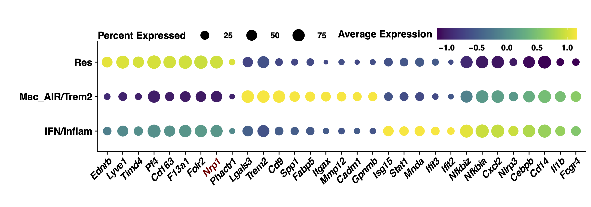|  Dotplot for selected markers of Mouse public atherosclerosis integrated scRNASeq data.|
|Fig4e | [[PDF](Figures_Tables/Fig4e-scRNASeqHuman_integrated_selMac_dotplot_selMarkers_C3_18_12_2023.pdf)] |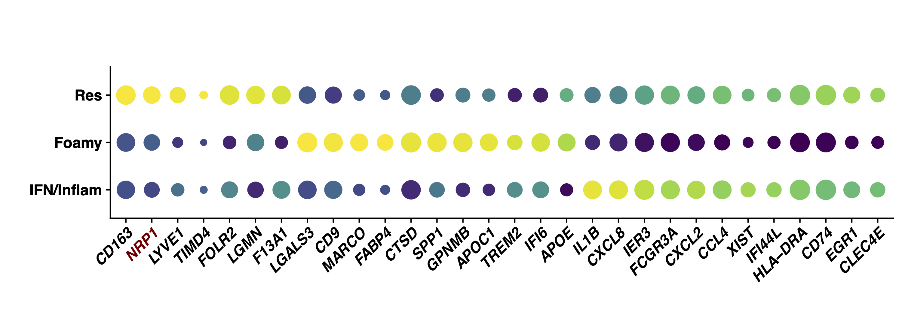| Dotplot for selected markers of Human public atherosclerosis integrated scRNASeq data.|
|Fig4f | [[PDF](Figures_Tables/Fig4f-Human_scRNASeq_Selcted_NRP1_highvslow_Barplot_N.pdf)] ||  Selected Biological process Gene ontology pathways for human NRP1 high clusters vs NRP1 low clusters. |
|Fig4h| [[PDF](Figures_Tables/Fig4h-Mouse_cWD_KOvsWT_Selcted_NRP1_highvslow_Barplot_N.pdf)] |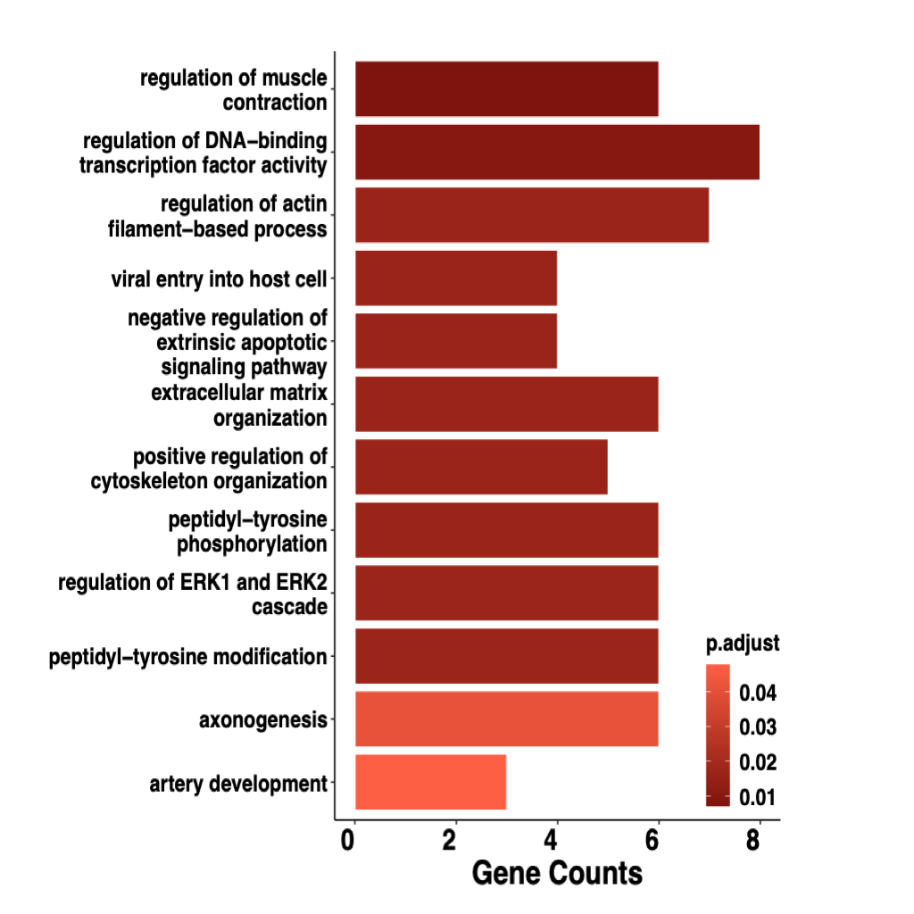|  Selected Biological process Gene ontology pathways for mouse cWD NRP1 KOvsWT. |
|Extended Fig6a | [[PDF](Figures_Tables/Extended_Fig6a-TFs_sig_Nsig_NES_difference_boxplot_01112023_new2_noviolet.pdf)] |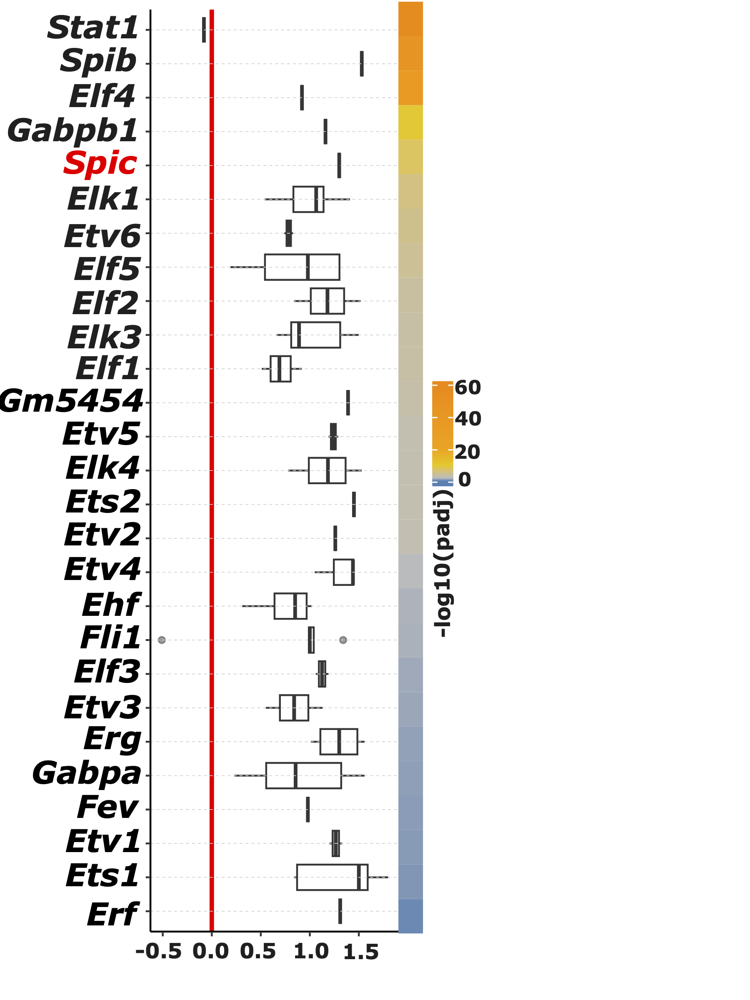| Transcription factor analysis for DEGs and nonDEGs Normalised enrichment score (NES) difference boxplot.|
|Extended Fig6b | [[PDF](Figures_Tables/Extended_Fig6b-Spic_selectedPathway_Barplot_Dec_2022.pdf)] |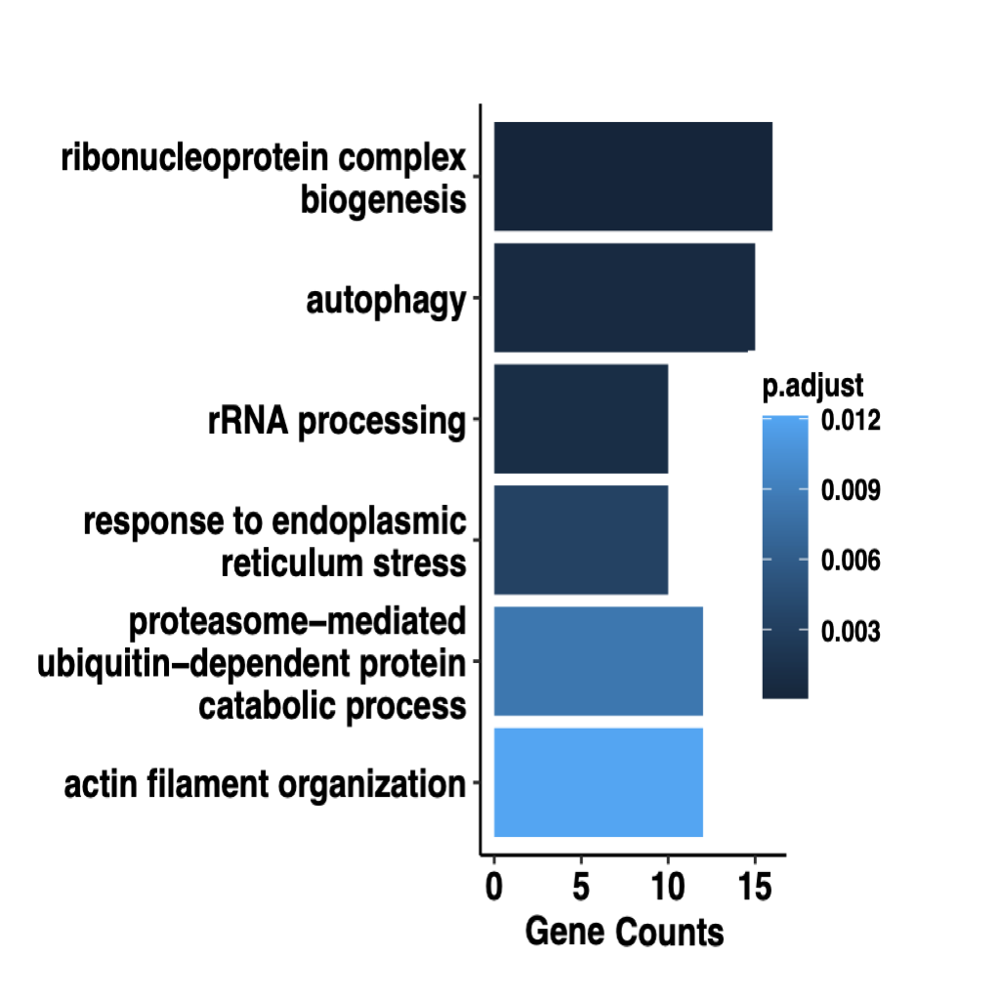| TF "Spic" relating DEGs selected Biological process enriched pathways bar plot.|
|Extended Fig7a | [[PDF](Figures_Tables/Extended_Fig7a-Heatmap_DEGs_MAST_GlobalC3_acrossTime_noall_selMarkers_Dec_2023.pdf)] |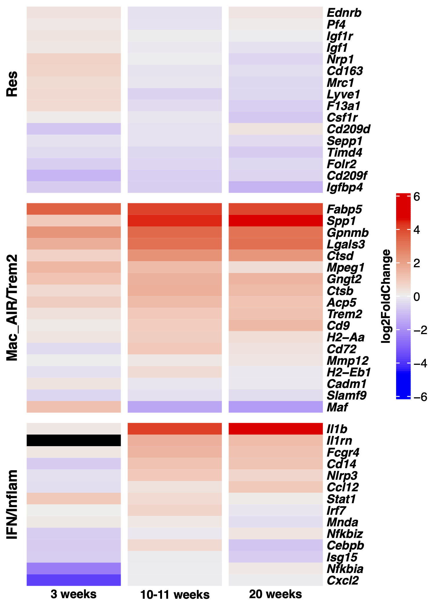|  A heatmap of selected markers for each macrophage subtype derived from analysis of the mouse public data set on scRNASeq of atherosclerosis lesions in Ldlr−/− mice subjected to various durations of continuous high fat diet (HFD).Hierarchical clustering is shown based on log2FoldChange. |
|Extended_Fig7b| [[PDF](Figures_Tables/Extended_Fig7b-Mouse_Mac_Proportion_HFDvsCtrl_Time_StackedBar_07112023_version1_update_29112023.pdf)] ||  Barplot for three macrophage subtype proportions for each duration of continuous HFD. |
|Extended_Fig10| [[PDF](Figures_Tables/Extended_Fig10-CVD_CasusalGenes_selPathway_cnetplot_112023_2.pdf)] ||  Gene ontology enrichment analysis of biological processes (BP) was conducted on 220 coronary artery disease causal genes prioritised in Aragam et al, 2022. A total of 178 out of 220 causal genes contributed to the GO enrichment analysis, and 867 enriched BP were idenAfied (see Supplementary Table 11). The most enriched pathways and their corresponding causal gene network are ploBed here using cnetplot function in R. Significant differentially expressed genes in our RNASeq data of aortic macrophages from iWD vs cWD (see Supplementary Table 1) are shown here (red: upregulated in iWD, blue: downregulated in iWD). NRP1 is represented in the most enriched biological pathways, which are related to cell migration, actin filament organisation, and vascular development|
|Addition Fig1a| [[PDF](Figures_Tables/AFig1a_Mouse_integrated_all_UMAP_MacGenes_Add_Adgre1_Fcgr1_Jun_2023.pdf)] |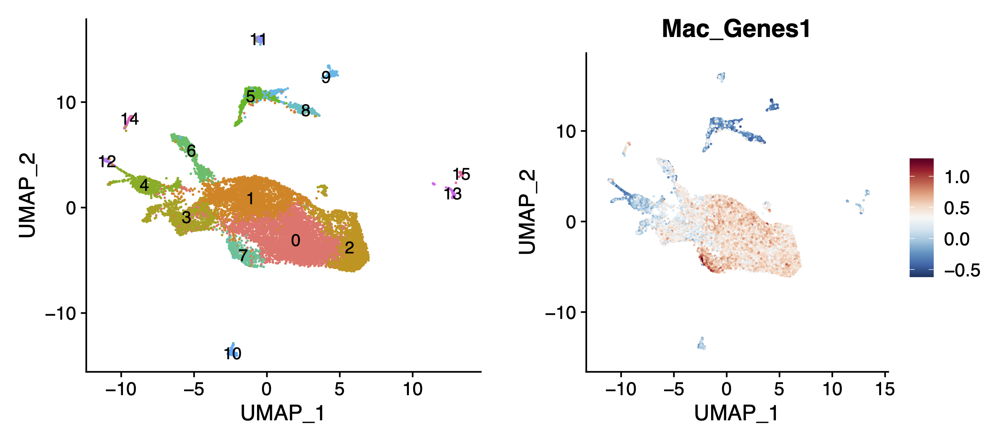|Integrating mouse public scRNSeq data: UMAP integrating all cell clusters (left), and FeaturePlot of the selected macrophage markers (right) (see Methods). |
|Addition Fig1b| [[PDF](Figures_Tables/AFig1b_v1_Macrophage_Ldlr_ChowHFD_res12_c19_seldefineColor_UMAP_subMac_18_12_2023.pdf)] |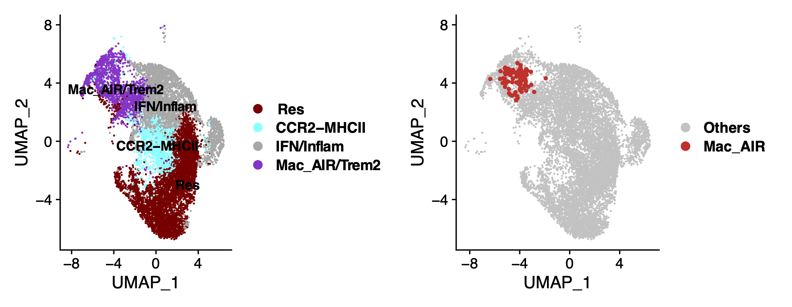|Integrating mouse public scRNSeq data: UMAP depicting macrophage re-clustering and annotation assignment, highlighting the MacAIR cells from Williams et al. (2020). |
|Addition Fig1c| [[PDF](Figures_Tables/AFig1c_v1_Macrophage_Ldlr_ChowHFD_res12_c19_seldefineColor_UMAP_subMac_GlobalF_18_12_2023.pdf)] |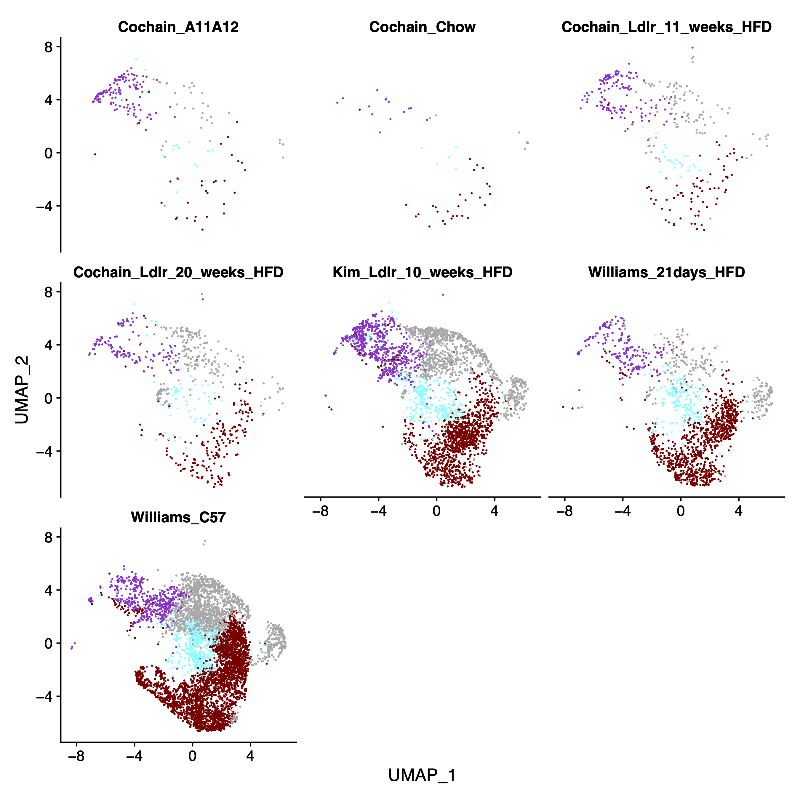|Integrating mouse public scRNSeq data: UMAP depicting macrophage re-clustering split by studies. |
|Addition Fig2a| [[PDF](Figures_Tables/AFig2a-Human_integrated_all_UMAP_MacGenes_Nov_2023.pdf)] |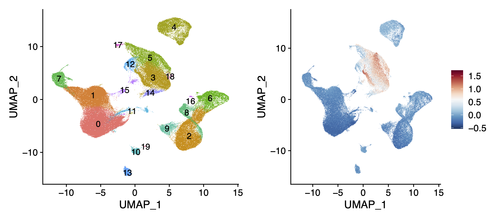|Integrating human public scRNSeq data: UMAP integrating all cell clusters (left), and FeaturePlot of the selected macrophage markers (right) (see Methods). |
|Addition Fig2b| [[PDF](Figures_Tables/AFig2b-Human_Macrophage_reclustered_UMAP_all_Nov_2023.pdf)] |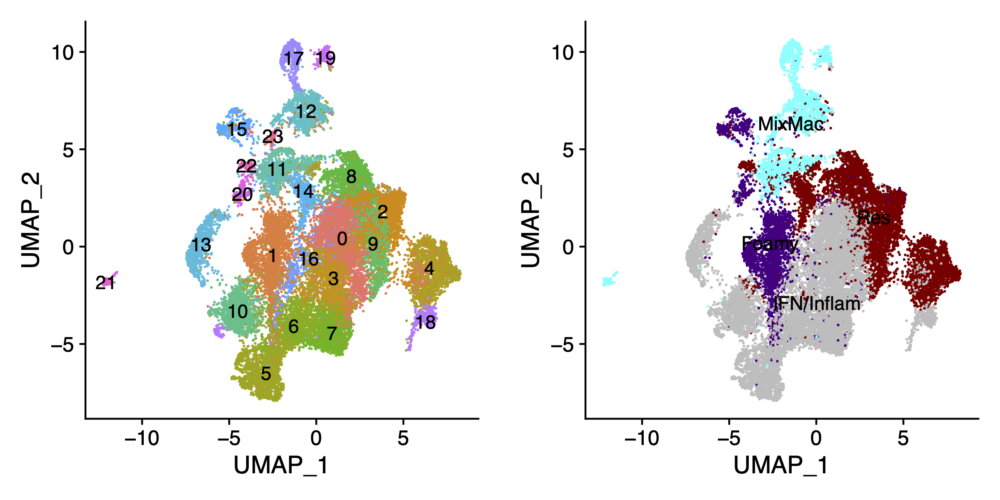| Integrating human public scRNSeq data: UMAP depicting macrophage re-clustering and annotation assignment |
|Addition Fig2c| [[PDF](Figures_Tables/AFig2c-Human_Macrophage_reclustered_UMAP_bystudy_Nov_2023.pdf)] |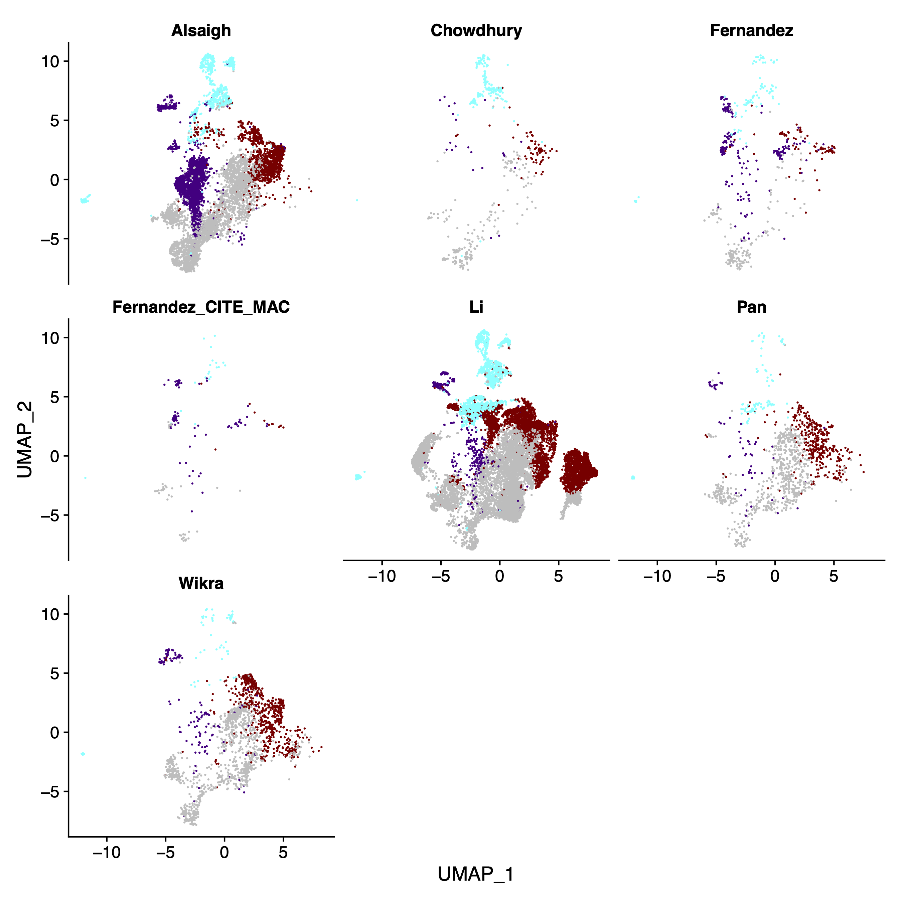| Integrating human public scRNSeq data: UMAP depicting macrophage re-clustering split by studies |

## Contact

Contact Xiaohui Zhao (xz289 -at- cam.ac.uk)
